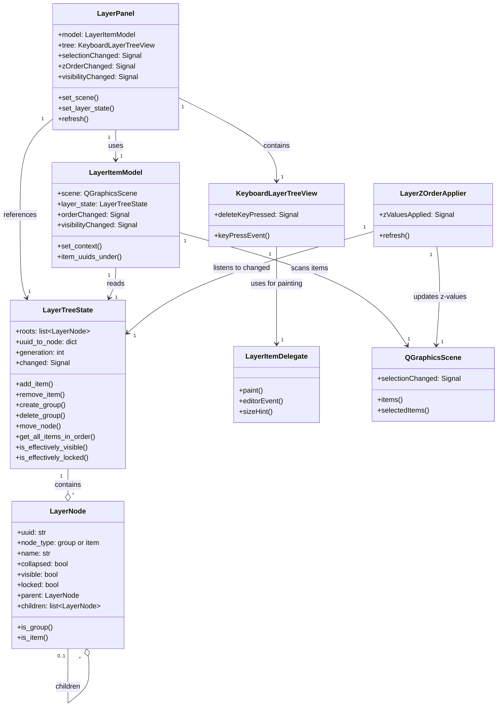
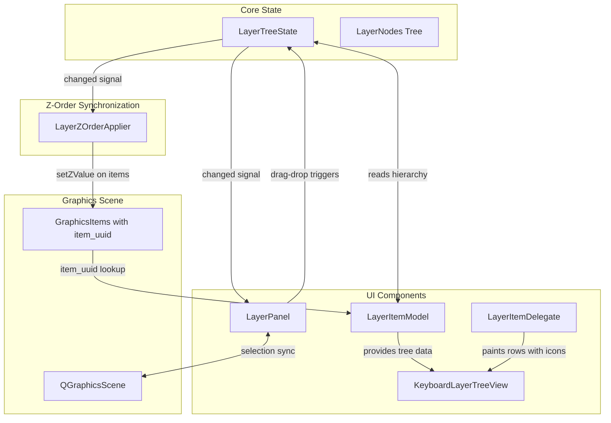

# Layer Widget System

This document describes the layer panel architecture in Optiverse, covering the core concepts, all related classes, their connections, and data flow.

## Introduction

The **Layer System** in Optiverse provides a hierarchical way to organize scene items, similar to layers in Photoshop or other design tools. It enables users to:

- **Organize items** into groups for logical organization
- **Control visibility** - hide/show items and entire groups
- **Lock items** - prevent accidental modifications
- **Manage z-order** - control which items appear in front of others
- **Drag-and-drop reordering** - intuitively reorganize the scene hierarchy

The layer panel appears as a dockable widget on the right side of the main window, displaying all scene items in a tree structure.

---

## Architecture Overview

The layer system follows Qt's **Model/View/Delegate** pattern:

- **Model** (`LayerItemModel`) - Provides data to the view
- **View** (`KeyboardLayerTreeView`) - Displays the tree structure with keyboard handling
- **Delegate** (`LayerItemDelegate`) - Custom painting and click handling

The core state is managed separately in `LayerTreeState`, which acts as the **single source of truth** for hierarchy and ordering.

### Class Relationships



---

## Data Flow

The following diagram shows how data flows through the layer system:



### Data Flow Description

1. **State Changes**: When the layer hierarchy changes (reorder, group, visibility toggle), `LayerTreeState` emits its `changed` signal
2. **UI Refresh**: `LayerPanel` receives the signal and triggers a debounced refresh of `LayerItemModel`
3. **Model Rebuild**: `LayerItemModel` scans the `QGraphicsScene` to build a UUID-to-item mapping and reads the hierarchy from `LayerTreeState`
4. **View Update**: `KeyboardLayerTreeView` displays the updated model data
5. **Z-Order Sync**: `LayerZOrderApplier` also receives the `changed` signal and updates `zValue()` on all scene items based on the traversal order

---

## Core Classes

### LayerTreeState

**File:** `src/optiverse/core/layer_tree_state.py`

The **single source of truth** for layer hierarchy and ordering. Scene z-values are derived from this state, never the other way around.

Key responsibilities:
- Maintains a tree of `LayerNode` objects
- Provides methods for adding/removing items and groups
- Tracks visibility and lock state per node
- Computes effective visibility/lock (inheriting from parents)
- Serializes to/from JSON for save/load
- Emits `changed` signal on any modification

```python
# Example: Creating a group and adding items
layer_state = LayerTreeState()
group_id = layer_state.create_group("My Group", parent_group_uuid=None, index=0)
layer_state.add_item("item-uuid-1", parent_group_uuid=group_id, index=0)
layer_state.add_item("item-uuid-2", parent_group_uuid=group_id, index=1)
```

### LayerNode

**File:** `src/optiverse/core/layer_tree_state.py`

A dataclass representing a single node in the layer tree. Nodes can be either:

- **Item nodes** (`node_type="item"`) - Reference scene objects by UUID
- **Group nodes** (`node_type="group"`) - Containers that can hold other nodes

| Attribute | Type | Description |
|-----------|------|-------------|
| `uuid` | `str` | Unique identifier (matches scene item's `item_uuid` for items) |
| `node_type` | `"group"` or `"item"` | Type of node |
| `name` | `str \| None` | Display name (for groups) |
| `collapsed` | `bool` | Whether group is collapsed in UI |
| `visible` | `bool` | Visibility state |
| `locked` | `bool` | Lock state |
| `parent` | `LayerNode \| None` | Parent node reference |
| `children` | `list[LayerNode]` | Child nodes (for groups) |

### LayerPanel

**File:** `src/optiverse/ui/widgets/layer_panel.py`

The main **UI widget** that displays the layer tree. It includes:

- Header with group/ungroup buttons
- Tree view for displaying the hierarchy
- Z-order buttons (Up/Down)

Key features:
- Debounced refresh (100ms timer) to avoid UI flicker
- Bidirectional selection sync with the scene
- Context menu with visibility, lock, and z-order options
- Double-click to rename items/groups

Signals:
- `selectionChanged` - Emitted when layer selection changes
- `zOrderChanged` - Emitted when z-order is modified
- `visibilityChanged` - Emitted when visibility is toggled

### KeyboardLayerTreeView

**File:** `src/optiverse/ui/views/keyboard_layer_tree_view.py`

A custom `QTreeView` subclass with keyboard handling for layer operations. It provides:

- Delete/Backspace key handling for deleting selected items/groups
- Emits `deleteKeyPressed` signal when delete is pressed (only when not in editing mode)
- Extensibility point for future keyboard shortcuts (e.g., Ctrl+G for grouping)

### LayerItemModel

**File:** `src/optiverse/ui/models/layer_item_model.py`

A Qt `QAbstractItemModel` that provides the tree data structure to the view. It:

- Reads hierarchy from `LayerTreeState`
- Scans `QGraphicsScene` to map UUIDs to actual items
- Handles drag-and-drop with MIME data encoding
- Applies effective visibility/lock states to scene items

Custom data roles:
| Role | Description |
|------|-------------|
| `ITEM_UUID_ROLE` | UUID of an item node |
| `GROUP_UUID_ROLE` | UUID of a group node |
| `IS_GROUP_ROLE` | Boolean: is this a group? |
| `VISIBLE_ROLE` | Visibility state |
| `LOCKED_ROLE` | Lock state |

### LayerItemDelegate

**File:** `src/optiverse/ui/delegates/layer_item_delegate.py`

Custom delegate for rendering layer rows. Uses **custom painting** instead of widgets (which would be lost during drag-drop).

Renders:
- 👁 Visibility toggle icon
- 🔒 Lock toggle icon
- 📁 Folder icon (for groups)
- Text label (item/group name)

Handles click events on icons to toggle visibility/lock without entering edit mode.

### LayerZOrderApplier

**File:** `src/optiverse/core/layer_zorder_applier.py`

Keeps scene item z-values synchronized with the layer hierarchy. This is the **only place** that should call `setZValue()` based on layer ordering.

When `LayerTreeState.changed` is emitted:
1. Gets the ordered list of item UUIDs via `get_all_items_in_order()`
2. Maps UUIDs to scene items
3. Assigns z-values (higher = in front) based on position in list

---

## Key Concepts

### Node Types

The layer system has two types of nodes:

| Type | Description | Can Have Children |
|------|-------------|-------------------|
| **Item** | References a scene object (optical component, ruler, etc.) | No |
| **Group** | A named container for organizing items | Yes |

### Effective Visibility and Lock

Visibility and lock states **inherit through the parent chain**:

- **Effective Visibility**: An item is visible only if it AND all its ancestors are visible (Photoshop-style)
- **Effective Lock**: An item is locked if it OR any ancestor is locked

```python
# Check effective states
if layer_state.is_effectively_visible(item_uuid):
    # Item will be rendered
    
if layer_state.is_effectively_locked(item_uuid):
    # Item cannot be moved or edited
```

### Z-Order Determination

Z-order is determined by a **depth-first traversal** of the layer tree:

1. Traverse root nodes from first to last
2. For each group, recursively traverse its children
3. Items encountered earlier get higher z-values (appear in front)

Example:
```
Root
├── Group A
│   ├── Item 1  → z=3 (highest, in front)
│   └── Item 2  → z=2
└── Item 3      → z=1
└── Item 4      → z=0 (lowest, in back)
```

### Signals and Debouncing

To prevent UI flicker during rapid changes, the `LayerPanel` uses **debounce timers**:

- `_refresh_timer` (100ms) - Delays model refresh
- `_sync_timer` (50ms) - Delays selection sync from scene

This ensures that multiple rapid changes result in a single UI update.

---

## Undo/Redo Commands

The layer system supports full undo/redo through three command classes in `src/optiverse/core/undo_commands.py`:

### MoveNodeCommand

Moves a node (item or group) to a new position in the hierarchy.

- Captures original parent and index on creation
- `execute()`: Moves to new position
- `undo()`: Restores to original position

### CreateGroupCommand

Creates a new group containing specified items.

- Captures original positions of all items
- `execute()`: Creates group and moves items into it
- `undo()`: Deletes group and restores items to original positions

### DeleteGroupCommand

Deletes a group, optionally keeping its items.

- Snapshots the entire group subtree for undo
- `execute()`: Deletes group (items either deleted or reparented)
- `undo()`: Recreates group with all original contents

---

## Serialization

Layer state is saved and loaded as part of the scene file.

### Saving (to_dict)

```python
data = layer_state.to_dict()
# Returns:
# {
#     "version": 1,
#     "nodes": [
#         {
#             "uuid": "group-uuid",
#             "type": "group",
#             "name": "My Group",
#             "collapsed": false,
#             "children": [
#                 {"uuid": "item-uuid-1", "type": "item"},
#                 {"uuid": "item-uuid-2", "type": "item", "visible": false}
#             ]
#         },
#         {"uuid": "item-uuid-3", "type": "item", "locked": true}
#     ]
# }
```

### Loading (from_dict)

```python
layer_state = LayerTreeState.from_dict(data)
```

### Legacy Migration

For older save files, `from_legacy()` converts the old group format to the new tree structure.

---

## Integration Points

### MainWindow Initialization

In `src/optiverse/ui/views/main_window.py`:

```python
def _build_layer_dock(self):
    self.layer_panel = LayerPanel(self)
    self.layer_panel.set_scene(self.scene)
    self.layer_panel.set_layer_state(self.layer_state)
    
    # Connect signals
    self.scene.selectionChanged.connect(self._sync_layer_panel_selection)
    self.layer_panel.zOrderChanged.connect(self._schedule_retrace)
    self.layer_panel.visibilityChanged.connect(self._schedule_retrace)
```

### Scene Items

All scene items that participate in the layer system must have an `item_uuid` attribute:

```python
class MySceneItem(QGraphicsObject):
    def __init__(self, item_uuid: str | None = None):
        super().__init__()
        self.item_uuid = item_uuid or str(uuid.uuid4())
```

Base classes that provide this:
- `BaseObj` - For optical components
- `BaseMeasureItem` - For measurement annotations
- `RulerItem`, `PathMeasureItem`, `AngleMeasureItem` - Annotation items

### Ray Tracing

Visibility changes affect ray tracing:
- Hidden sources don't emit rays
- Hidden components don't interact with rays
- The `visibilityChanged` signal triggers a retrace

---

## File Reference

| File | Description |
|------|-------------|
| `src/optiverse/core/layer_tree_state.py` | Core state (LayerTreeState, LayerNode) |
| `src/optiverse/core/layer_zorder_applier.py` | Z-value synchronization |
| `src/optiverse/ui/widgets/layer_panel.py` | Main widget (LayerPanel) |
| `src/optiverse/ui/views/keyboard_layer_tree_view.py` | Custom tree view with keyboard handling |
| `src/optiverse/ui/models/layer_item_model.py` | Qt tree model |
| `src/optiverse/ui/delegates/layer_item_delegate.py` | Custom row painting |
| `src/optiverse/ui/widgets/constants.py` | UI constants (Icons class, sizes) |
| `src/optiverse/core/undo_commands.py` | Undo commands for layer operations |
| `tests/core/test_layer_tree_state.py` | Unit tests for LayerTreeState |

---

## Icons Class Reference

The `Icons` class in `src/optiverse/ui/widgets/constants.py` defines the visual symbols used throughout the layer panel UI:

```python
class Icons:
    """Emoji icons used in the UI."""
    VISIBLE: str = "👁"       # Eye icon - item is visible
    HIDDEN: str = "○"         # Empty circle - item is hidden
    LOCKED: str = "🔒"        # Closed lock - item is locked (cannot be edited)
    UNLOCKED: str = "🔓"      # Open lock - item is unlocked
    FOLDER: str = "📁"        # Folder icon - displayed for group nodes
    FOLDER_ADD: str = "📁+"   # Add folder button in header
    FOLDER_REMOVE: str = "📁-" # Remove folder button in header
    N1_COLOR: str = "#FFD700" # Gold color for n1 refractive index labels
    N2_COLOR: str = "#9370DB" # Purple color for n2 refractive index labels
```

### Icon Usage

| Icon | Context | Click Behavior |
|------|---------|----------------|
| `VISIBLE` / `HIDDEN` | Left side of each row | Toggles item/group visibility |
| `LOCKED` / `UNLOCKED` | Next to visibility icon | Toggles item/group lock state |
| `FOLDER` | Before group name | Indicates a group node (no click action) |
| `FOLDER_ADD` | Header toolbar | Opens dialog to group selected items |
| `FOLDER_REMOVE` | Header toolbar | Ungroups the selected group |

The `LayerItemDelegate` uses these icons during custom painting. Click handling for toggle icons is implemented in `LayerItemDelegate.editorEvent()`.

